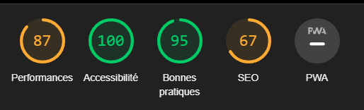

# Projet IHM - MVC 
Ce document constitue mon rendu pour la partie conception d'un Modèle-Vue-Contrôleur (MVC) en Javascript, basé sur notre maquette Figma pour une application de mise en relation de coureurs. Dans le cadre de ce projet, j'ai choisi de présenter spécifiquement le volet "Communauté", en mettant l'accent exclusivement sur les publications de l'utilisateur associé au compte.

## Pour visualiser la page web correctement en tant qu'application mobile, veuillez suivre ces étapes :

1. Sur la page web, cliquez sur "Inspecter".
2. Choisissez une disposition d'écran de type téléphone sur le toggle.
3. Assurez-vous que le zoom est à 100%.

*Exemple de publication sur la vue mobile de la page Communauté*

## Optimisation et Bonnes Pratiques
Cette application a été conçue en mettant l'accent sur plusieurs aspects pour optimiser les performances, l'accessibilité, les bonnes pratiques et le SEO.
Le projet a été soumis aux tests Lighthouse pour évaluer ses performances. Les résultats se sont avérés satisfaisants, mettant en évidence une attention particulière portée à ces critères :

- `Accessibilité à 100%` : Un objectif prioritaire, l'interface a été conçue en tenant compte des recommandations pour garantir une accessibilité maximale.
- `Optimisation native` : Le code, y compris le CSS, a été développé en natif pour maximiser les performances.
- `SEO` : Bien que la balise de viewport soit commentée dans le HTML pour des raisons de comportement responsive, le design vise à maximiser les résultats en SEO.

*Résultats Tests Lighthouse sans balise viewport*

*Résultats Tests Lighthouse avec balise viewport*

## Conception et Adaptations
Ce projet s'inspire d'une maquette réalisée dans le cadre du cours d'IHM. Pour répondre à divers critères, des ajustements ont été apportés :

- `Contraste amélioré` : Les couleurs ont été ajustées pour augmenter le contraste, facilitant ainsi la lisibilité pour les personnes atteintes de daltonisme.

- `Fonctionnalités` : L'application permet principalement d'ajouter et de supprimer des publications sur la page "Communauté". Plutôt que de multiplier les fonctionnalités complexes, l'accent a été mis sur la qualité et l'implémentation des bonnes pratiques pour ces actions simples mais essentielles.

- `Modifications de la Maquette Initiale` : Initialement conçue pour représenter deux pages distinctes dans Figma, l'application a été ajustée pour ne coder qu'une seule page, offrant ainsi la possibilité de publier et de voir ses propres publications sur la même interface.

# Description des Fichiers
- `index.html` : Le fichier index.html représente la page principale de l'application. Il contient la structure HTML de l'interface utilisateur, incluant les champs de saisie pour le titre et la description des publications, ainsi que la liste des publications.

- `style.css` : Le fichier style.css contient les styles CSS utilisés pour le design et la mise en forme de l'application. Il définit les propriétés visuelles des éléments de l'interface, assurant cohérence et esthétique.

- `model.js` : Ce fichier définit le modèle de données utilisé dans l'application, incluant les méthodes pour ajouter et récupérer des publications.
- `view.js` : Il gère l'interface utilisateur et contient la logique pour afficher les publications.
- `controller.js` : Fichier représentant le contrôleur, responsable de la gestion des interactions utilisateur telles que l'ajout et l'affichage des publications.
- `app.js` : Ce fichier représente le point d'entrée principal de l'application, appelant les fonctions nécessaires pour afficher les publications dès le chargement de la page.

